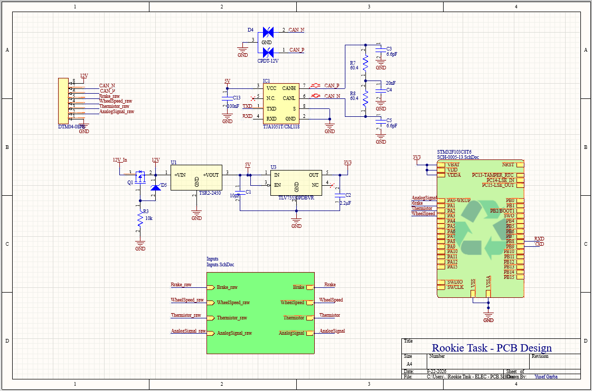

# PCB VCU Schematic — Formula SAE Electric

Rookie task for Concordia's SAE Electric team: designed a Vehicle Control Unit (VCU) schematic incorporating power conditioning, an STM32 microcontroller, analog/digital sensor inputs, and a CAN bus interface.

---

## Schematic Overview

> **View Complete Design:** [Download the full PDF schematic](./Rookie%20Task%20-%20ELEC%20-%20PCB.pdf)

---

## Hardware Architecture & Subsystems
* **Microcontroller:** STM32 core handling sensor acquisition and communications.
* **CAN Bus Interface:** Dedicated CAN transceiver circuitry designed for vehicle-bus telemetry and noise rejection.
* **Power Conditioning:** Input protection and step-down regulation to supply clean 3.3V/5V rails.
* **Sensor Inputs:** 4 conditioning circuits with analog filtering and pull-up/pull-down networks.

## Tools Used
* **EDA:** Altium Designer
* **Target Application:** FSAE Electric Vehicle Control Unit
